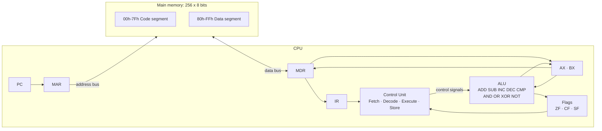

# MidTerm1_SIS-131: 8-bit CPU Simulator

8-bit von Neumann CPU simulator with 256 bytes of main memory, built in Microsoft Excel with VBA.
Computer Architecture (SIS-131), Midterm 1, UCB Santa Cruz.

The simulator shows the full instruction cycle (Fetch, Decode, Execute, Store) one phase at a time or continuously, with every register, flag and memory cell visible on the sheet.

**Defense presentation (Spanish):** [Open slides in Canva](https://canva.link/a534pm9q2unoc57)

## Contents

1. [Architecture](#architecture)
2. [Memory map](#memory-map)
3. [Registers and flags](#registers-and-flags)
4. [Instruction cycle](#instruction-cycle)
5. [Instruction Set Architecture (ISA)](#instruction-set-architecture-isa)
6. [Demo program and register trace](#demo-program-and-register-trace)
7. [User manual](#user-manual)
8. [Tests](#tests)
9. [Code structure](#code-structure)

## Architecture

The design follows the von Neumann model: one memory holds both the program and the data, and the CPU reaches it only through MAR (address) and MDR (data). The opcode and every operand are read the same way.

## Memory map

| Range | Segment | Use |
|---|---|---|
| 00h-7Fh | Code | Program instructions (light blue on the sheet) |
| 80h-FFh | Data | Variables and results (light green on the sheet) |

- 256 cells of 8 bits, shown as a 16 x 16 grid. The row header is the high nibble and the column header is the low nibble, so the cell in row 8, column 2 is address 82h.
- Each cell shows its value in hexadecimal. The memory inspector shows any address in hexadecimal, binary, decimal and as a mnemonic.
- All memory access goes through two routines: `Read(address)` and `WriteMemory(address, value)`.
- A value typed directly into the grid is validated (00h to FFh) and written to memory, so instructions can be changed live.

## Registers and flags

| Register | Size | Role |
|---|---|---|
| PC | 8 bits | Address of the next byte to read |
| IR | 8 bits | Opcode of the current instruction |
| MAR | 8 bits | Address sent to memory |
| MDR | 8 bits | Data coming from or going to memory |
| AX | 8 bits | General purpose register, code 00h |
| BX | 8 bits | General purpose register, code 01h |

| Flag | Set to 1 when |
|---|---|
| ZF (Zero) | The 8-bit result is 00h |
| CF (Carry) | An unsigned addition goes over FFh, or a subtraction/compare needs a borrow (a < b) |
| SF (Sign) | Bit 7 of the result is 1 (negative in two's complement) |

`MOV`, `LOAD`, `STORE`, jumps and `HLT` do not change the flags. `INC` and `DEC` update ZF and SF and keep CF, like the x86.

## Instruction cycle

Each instruction runs in four phases. One click on STEP runs one phase.

| Phase | Micro-operations |
|---|---|
| FETCH | MAR ← PC, MDR ← RAM[MAR], IR ← MDR, PC ← PC + 1 |
| DECODE | The control unit reads the opcode in IR and loads the operands: for each one, MAR ← PC, MDR ← RAM[MAR], operand ← MDR, PC ← PC + 1 |
| EXECUTE | The ALU runs the operation and updates the flags, a jump changes PC, or LOAD reads memory (MAR ← address, MDR ← RAM[MAR]) |
| STORE | The result is written to AX or BX, or MDR is written to RAM[MAR] |

Execute keeps its result in pending variables and Store writes it, so every phase can be seen on its own. Instructions with nothing to write (CMP, jumps, HLT) do nothing in Store.

## Instruction Set Architecture (ISA)

Instructions have variable length: one opcode byte followed by zero, one or two operand bytes. Opcodes are grouped by type: 1x data transfer, 2x arithmetic, 3x control flow.

| Opcode | Mnemonic | Bytes | Format | Description | Flags |
|---|---|---:|---|---|---|
| 10h | MOV reg, imm | 3 | 10 r imm | reg ← imm | None |
| 11h | MOV reg, reg | 3 | 11 rd rs | rd ← rs | None |
| 12h | LOAD reg, [addr] | 3 | 12 r addr | reg ← RAM[addr] | None |
| 13h | STORE [addr], reg | 3 | 13 addr r | RAM[addr] ← reg | None |
| 20h | ADD reg, imm | 3 | 20 r imm | reg ← reg + imm | ZF, CF, SF |
| 21h | ADD reg, reg | 3 | 21 rd rs | rd ← rd + rs | ZF, CF, SF |
| 22h | SUB reg, imm | 3 | 22 r imm | reg ← reg − imm | ZF, CF, SF |
| 23h | SUB reg, reg | 3 | 23 rd rs | rd ← rd − rs | ZF, CF, SF |
| 24h | INC reg | 2 | 24 r | reg ← reg + 1 | ZF, SF (CF kept) |
| 25h | DEC reg | 2 | 25 r | reg ← reg − 1 | ZF, SF (CF kept) |
| 26h | CMP reg, imm | 3 | 26 r imm | reg − imm, result not saved | ZF, CF, SF |
| 27h | CMP reg, reg | 3 | 27 ra rb | ra − rb, result not saved | ZF, CF, SF |
| 30h | JMP addr | 2 | 30 addr | PC ← addr | None |
| 31h | JZ addr | 2 | 31 addr | If ZF = 1, PC ← addr | None |
| 32h | JNZ addr | 2 | 32 addr | If ZF = 0, PC ← addr | None |
| FFh | HLT | 1 | FF | Stops the clock | None |

Register codes: 00h = AX, 01h = BX. Any other opcode is treated as invalid and halts the CPU.

The ALU also implements AND, OR, XOR and NOT. They are tested in `TestALU` but are not part of the minimum instruction set required by the assignment.

## Demo program and register trace

### Multiplication by repeated addition: 3 x 4 = 12

The counter lives in memory because the CPU has only two registers. AX handles the counter and the multiplicand, and BX accumulates the result.

Initial data (loaded by LOAD PROGRAM):

| Address | Value | Meaning |
|---|---:|---|
| 80h | 03h | Multiplicand |
| 81h | 04h | Counter |
| 82h | 00h | Result (written by the program) |

Program listing:

| Addr | Bytes | Instruction | Comment |
|---|---|---|---|
| 00h | 12 00 81 | LOAD AX, [81h] | Loop start: read the counter |
| 03h | 26 00 00 | CMP AX, 00h | Is the counter 0? |
| 06h | 31 15 | JZ 15h | If yes, leave the loop |
| 08h | 25 00 | DEC AX | Counter − 1 |
| 0Ah | 13 81 00 | STORE [81h], AX | Save the counter |
| 0Dh | 12 00 80 | LOAD AX, [80h] | Read the multiplicand |
| 10h | 21 01 00 | ADD BX, AX | BX ← BX + multiplicand |
| 13h | 30 00 | JMP 00h | Back to the loop start |
| 15h | 13 82 01 | STORE [82h], BX | Save the result |
| 18h | FF | HLT | Stop |

Jump check: the loop body takes 3+3+2+2+3+3+3+2 = 21 bytes, so the exit STORE sits at 15h (21 decimal).

### Phase-by-phase trace of the first instruction

`LOAD AX, [81h]` starting with PC = 00h:

| Phase | PC | MAR | MDR | IR | AX | What happens |
|---|---|---|---|---|---|---|
| FETCH | 01h | 00h | 12h | 12h | 00h | Opcode 12h read from 00h |
| DECODE (operand 1) | 02h | 01h | 00h | 12h | 00h | Register code 00h = AX |
| DECODE (operand 2) | 03h | 02h | 81h | 12h | 00h | Address 81h |
| EXECUTE | 03h | 81h | 04h | 12h | 00h | RAM[81h] read into MDR |
| STORE | 03h | 81h | 04h | 12h | 04h | AX ← 04h |

### Register trace per loop iteration

Values after `ADD BX, AX` in each iteration:

| Iteration | RAM[81h] | AX | BX | ZF | CF | SF |
|---:|---:|---:|---:|---:|---:|---:|
| Start | 04h | 00h | 00h | 0 | 0 | 0 |
| 1 | 03h | 03h | 03h | 0 | 0 | 0 |
| 2 | 02h | 03h | 06h | 0 | 0 | 0 |
| 3 | 01h | 03h | 09h | 0 | 0 | 0 |
| 4 | 00h | 03h | 0Ch | 0 | 0 | 0 |

Exit: `LOAD AX, [81h]` gives AX = 00h, `CMP AX, 00h` sets ZF = 1, `JZ 15h` is taken, `STORE [82h], BX` writes 0Ch, and `HLT` stops the clock.

Final state:

| Item | Value |
|---|---|
| AX | 00h |
| BX | 0Ch (12) |
| RAM[81h] | 00h |
| RAM[82h] | 0Ch (12) |
| ZF, CF, SF | 1, 0, 0 |
| PC | 19h |

In total the program runs 37 instructions: 8 per iteration x 4 iterations, plus 5 on the way out.

### Second program: countdown with JNZ

Loaded with LOAD COUNTDOWN. It counts 5 down to 0, saving each value at 80h.

| Addr | Bytes | Instruction |
|---|---|---|
| 00h | 12 00 80 | LOAD AX, [80h] |
| 03h | 25 00 | DEC AX |
| 05h | 13 80 00 | STORE [80h], AX |
| 08h | 26 00 00 | CMP AX, 00h |
| 0Bh | 32 03 | JNZ 03h |
| 0Dh | FF | HLT |

Initial data: 80h = 05h. Final state: AX = 00h, RAM[80h] = 00h, ZF = 1.

## User manual

1. **Open the file.** Open `CPUSimulator.xlsm` in desktop Excel (Excel Online does not run macros) and click **Enable Content** when the macro warning appears.
2. **Load a program.** Click **LOAD PROGRAM** for the multiplication demo or **LOAD COUNTDOWN** for the second program. The code appears in the blue segment, the data in the green segment, and the CPU is reset.
3. **Run it step by step.** Click **STEP**. Each click runs one phase. The active phase lights up in the phase panel (FETCH, DECODE, EXECUTE, STORE), the registers and memory cell involved are highlighted, and one line is added to the micro-operation log.
4. **Run it continuously.** Type a delay in milliseconds in the **DELAY (ms)** cell (for example 300) and click **RUN**. The program runs until HLT.
5. **Pause.** Click **PAUSE** during RUN. Execution stops at the current phase. STEP or RUN continue from there.
6. **Reset.** Click **RESET**. Registers, flags, PC and phase go back to zero and the log is cleared. The program stays in memory, so it can run again.
7. **Edit memory by hand.** Click any cell of the grid and type a hex value from 00 to FF (with or without `h`). Invalid values are rejected. This is how a new instruction can be inserted while the simulator is open.
8. **Inspect an address.** Type an address in the inspector's **Address** cell and click **INSPECT**. It shows the value in hexadecimal, binary and decimal, and the mnemonic if the byte is an opcode.

## Tests

The tests are in `modTest` and print PASS or FAIL in the VBA Immediate Window (`Ctrl + G`).

| Macro | What it checks |
|---|---|
| `TestALU` | The nine ALU operations and the ZF, CF and SF flags |
| `TestMultiplicationProgram` | The demo program halts with BX = 0Ch, RAM[81h] = 00h and RAM[82h] = 0Ch |
| `TestEdgeCases` | FFh + 01h = 00h with CF = 1, PC wraps from FFh to 00h, JZ is not taken when ZF = 0, an invalid opcode halts the CPU |

## Code structure

| File | Contents |
|---|---|
| `src/modMemory.bas` | Memory grid, `Read`, `WriteMemory` |
| `src/modALU.bas` | ALU operations and `UpdateFlags` |
| `src/modCPU.bas` | Registers, Fetch, Decode, Execute, Store, STEP/RUN/PAUSE/RESET, demo programs |
| `src/modUI.bas` | Micro-operation log and highlighting |
| `src/modTest.bas` | Automated tests |
| `src/modControl.bas` | `ExportModules`, which saves the VBA code as text in `src/` |
| `src/Hoja1.cls` | Validation of manual memory edits |

The `.xlsm` is binary, so the code is exported to `src/` before every commit. That way each commit shows the real code changes.

The memory map leaves room for the second midterm: the system bus and I/O can be added as new modules without changing the CPU cycle.
