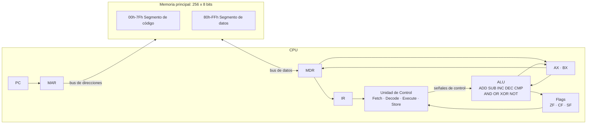

# MidTerm1_SIS-131: Simulador de CPU de 8 bits

Simulador de una CPU de 8 bits con arquitectura von Neumann y 256 bytes de memoria principal, hecho en Microsoft Excel con VBA.
Arquitectura de Computadoras (SIS-131), Primer Parcial, UCB Santa Cruz.

El simulador muestra el ciclo de instrucción completo (Fetch, Decode, Execute, Store) fase por fase o de forma continua, con todos los registros, flags y celdas de memoria visibles en la hoja.

**Presentación de la defensa:** [Abrir diapositivas](https://canva.link/a534pm9q2unoc57)

## Contenido

1. [Arquitectura](#arquitectura)
2. [Mapa de memoria](#mapa-de-memoria)
3. [Registros y flags](#registros-y-flags)
4. [Ciclo de instrucción](#ciclo-de-instrucción)
5. [Conjunto de instrucciones (ISA)](#conjunto-de-instrucciones-isa)
6. [Programa de demostración y traza de registros](#programa-de-demostración-y-traza-de-registros)
7. [Manual de usuario](#manual-de-usuario)
8. [Pruebas](#pruebas)
9. [Estructura del código](#estructura-del-código)

## Arquitectura

El diseño sigue el modelo von Neumann: una sola memoria guarda el programa y los datos, y la CPU solo accede a ella a través de MAR (dirección) y MDR (dato). El opcode y cada operando se leen de la misma forma.

## Mapa de memoria

| Rango | Segmento | Uso |
|---|---|---|
| 00h-7Fh | Código | Instrucciones del programa (celeste en la hoja) |
| 80h-FFh | Datos | Variables y resultados (verde claro en la hoja) |

- 256 celdas de 8 bits, mostradas como una grilla de 16 x 16. El encabezado de fila es el nibble alto y el de columna es el nibble bajo, así que la celda de la fila 8, columna 2 es la dirección 82h.
- Cada celda muestra su valor en hexadecimal. El inspector de memoria muestra cualquier dirección en hexadecimal, binario, decimal y como mnemónico.
- Todo acceso a memoria pasa por dos rutinas: `Read(address)` y `WriteMemory(address, value)`.
- Un valor escrito directamente en la grilla se valida (00h a FFh) y se guarda en memoria, así que las instrucciones se pueden cambiar en vivo.

## Registros y flags

| Registro | Tamaño | Función |
|---|---|---|
| PC | 8 bits | Dirección del siguiente byte a leer |
| IR | 8 bits | Opcode de la instrucción actual |
| MAR | 8 bits | Dirección que se envía a memoria |
| MDR | 8 bits | Dato que viene de memoria o va hacia ella |
| AX | 8 bits | Registro de propósito general, código 00h |
| BX | 8 bits | Registro de propósito general, código 01h |

| Flag | Se pone en 1 cuando |
|---|---|
| ZF (Zero) | El resultado de 8 bits es 00h |
| CF (Carry) | Una suma sin signo pasa de FFh, o una resta/comparación necesita préstamo (a < b) |
| SF (Sign) | El bit 7 del resultado es 1 (negativo en complemento a dos) |

`MOV`, `LOAD`, `STORE`, los saltos y `HLT` no cambian los flags. `INC` y `DEC` actualizan ZF y SF y mantienen CF, igual que en x86.

## Ciclo de instrucción

Cada instrucción se ejecuta en cuatro fases. Un clic en STEP ejecuta una fase.

| Fase | Micro-operaciones |
|---|---|
| FETCH | MAR ← PC, MDR ← RAM[MAR], IR ← MDR, PC ← PC + 1 |
| DECODE | La unidad de control lee el opcode en IR y carga los operandos: para cada uno, MAR ← PC, MDR ← RAM[MAR], operando ← MDR, PC ← PC + 1 |
| EXECUTE | La ALU hace la operación y actualiza los flags, un salto cambia el PC, o LOAD lee memoria (MAR ← dirección, MDR ← RAM[MAR]) |
| STORE | El resultado se escribe en AX o BX, o MDR se escribe en RAM[MAR] |

Execute guarda su resultado en variables pendientes y Store lo escribe, así cada fase se puede ver por separado. Las instrucciones que no tienen nada que escribir (CMP, saltos) no hacen nada en Store. HLT también pasa por las cuatro fases: Execute solo solicita la parada y el reloj se detiene realmente en Store.

## Conjunto de instrucciones (ISA)

Las instrucciones tienen longitud variable: un byte de opcode seguido de cero, uno o dos bytes de operandos. Los opcodes se agrupan por tipo: 1x transferencia de datos, 2x aritmética, 3x control de flujo.

| Opcode | Mnemónico | Bytes | Formato | Descripción | Flags |
|---|---|---:|---|---|---|
| 10h | MOV reg, imm | 3 | 10 r imm | reg ← imm | Ninguno |
| 11h | MOV reg, reg | 3 | 11 rd rs | rd ← rs | Ninguno |
| 12h | LOAD reg, [addr] | 3 | 12 r addr | reg ← RAM[addr] | Ninguno |
| 13h | STORE [addr], reg | 3 | 13 addr r | RAM[addr] ← reg | Ninguno |
| 20h | ADD reg, imm | 3 | 20 r imm | reg ← reg + imm | ZF, CF, SF |
| 21h | ADD reg, reg | 3 | 21 rd rs | rd ← rd + rs | ZF, CF, SF |
| 22h | SUB reg, imm | 3 | 22 r imm | reg ← reg − imm | ZF, CF, SF |
| 23h | SUB reg, reg | 3 | 23 rd rs | rd ← rd − rs | ZF, CF, SF |
| 24h | INC reg | 2 | 24 r | reg ← reg + 1 | ZF, SF (CF se mantiene) |
| 25h | DEC reg | 2 | 25 r | reg ← reg − 1 | ZF, SF (CF se mantiene) |
| 26h | CMP reg, imm | 3 | 26 r imm | reg − imm, el resultado no se guarda | ZF, CF, SF |
| 27h | CMP reg, reg | 3 | 27 ra rb | ra − rb, el resultado no se guarda | ZF, CF, SF |
| 30h | JMP addr | 2 | 30 addr | PC ← addr | Ninguno |
| 31h | JZ addr | 2 | 31 addr | Si ZF = 1, PC ← addr | Ninguno |
| 32h | JNZ addr | 2 | 32 addr | Si ZF = 0, PC ← addr | Ninguno |
| FFh | HLT | 1 | FF | Detiene el reloj | Ninguno |

Códigos de registro: 00h = AX, 01h = BX. Cualquier otro opcode se considera inválido y detiene la CPU.

La ALU también implementa AND, OR, XOR y NOT. Se prueban en `TestALU`, pero no forman parte del conjunto mínimo de instrucciones que pide el enunciado.

## Programa de demostración y traza de registros

### Multiplicación por sumas sucesivas: 3 x 4 = 12

El contador vive en memoria porque la CPU tiene solo dos registros. AX maneja el contador y el multiplicando, y BX acumula el resultado.

Datos iniciales (los carga LOAD PROGRAM):

| Dirección | Valor | Significado |
|---|---:|---|
| 80h | 03h | Multiplicando |
| 81h | 04h | Contador |
| 82h | 00h | Resultado (lo escribe el programa) |

Listado del programa:

| Dir | Bytes | Instrucción | Comentario |
|---|---|---|---|
| 00h | 12 00 81 | LOAD AX, [81h] | Inicio del bucle: leer el contador |
| 03h | 26 00 00 | CMP AX, 00h | ¿El contador es 0? |
| 06h | 31 15 | JZ 15h | Si es así, salir del bucle |
| 08h | 25 00 | DEC AX | Contador − 1 |
| 0Ah | 13 81 00 | STORE [81h], AX | Guardar el contador |
| 0Dh | 12 00 80 | LOAD AX, [80h] | Leer el multiplicando |
| 10h | 21 01 00 | ADD BX, AX | BX ← BX + multiplicando |
| 13h | 30 00 | JMP 00h | Volver al inicio del bucle |
| 15h | 13 82 01 | STORE [82h], BX | Guardar el resultado |
| 18h | FF | HLT | Parar |

Verificación del salto: el cuerpo del bucle ocupa 3+3+2+2+3+3+3+2 = 21 bytes, así que el STORE de salida queda en 15h (21 en decimal).

### Traza fase por fase de la primera instrucción

`LOAD AX, [81h]` empezando con PC = 00h:

| Fase | PC | MAR | MDR | IR | AX | Qué pasa |
|---|---|---|---|---|---|---|
| FETCH | 01h | 00h | 12h | 12h | 00h | Se lee el opcode 12h desde 00h |
| DECODE (operando 1) | 02h | 01h | 00h | 12h | 00h | Código de registro 00h = AX |
| DECODE (operando 2) | 03h | 02h | 81h | 12h | 00h | Dirección 81h |
| EXECUTE | 03h | 81h | 04h | 12h | 00h | RAM[81h] se lee en MDR |
| STORE | 03h | 81h | 04h | 12h | 04h | AX ← 04h |

### Traza de registros por iteración

Valores después de `ADD BX, AX` en cada iteración:

| Iteración | RAM[81h] | AX | BX | ZF | CF | SF |
|---:|---:|---:|---:|---:|---:|---:|
| Inicio | 04h | 00h | 00h | 0 | 0 | 0 |
| 1 | 03h | 03h | 03h | 0 | 0 | 0 |
| 2 | 02h | 03h | 06h | 0 | 0 | 0 |
| 3 | 01h | 03h | 09h | 0 | 0 | 0 |
| 4 | 00h | 03h | 0Ch | 0 | 0 | 0 |

Salida: `LOAD AX, [81h]` deja AX = 00h, `CMP AX, 00h` pone ZF = 1, se toma `JZ 15h`, `STORE [82h], BX` escribe 0Ch y `HLT` detiene el reloj.

Estado final:

| Elemento | Valor |
|---|---|
| AX | 00h |
| BX | 0Ch (12) |
| RAM[81h] | 00h |
| RAM[82h] | 0Ch (12) |
| ZF, CF, SF | 1, 0, 0 |
| PC | 19h |

En total el programa ejecuta 37 instrucciones: 8 por iteración x 4 iteraciones, más 5 a la salida.

### Segundo programa: cuenta regresiva con JNZ

Se carga con LOAD COUNTDOWN. Cuenta de 5 a 0 y guarda cada valor en 80h.

| Dir | Bytes | Instrucción |
|---|---|---|
| 00h | 12 00 80 | LOAD AX, [80h] |
| 03h | 25 00 | DEC AX |
| 05h | 13 80 00 | STORE [80h], AX |
| 08h | 26 00 00 | CMP AX, 00h |
| 0Bh | 32 03 | JNZ 03h |
| 0Dh | FF | HLT |

Dato inicial: 80h = 05h. Estado final: AX = 00h, RAM[80h] = 00h, ZF = 1.

## Manual de usuario

1. **Abrir el archivo.** Abre `CPUSimulator.xlsm` en Excel de escritorio (Excel Online no ejecuta macros) y haz clic en **Habilitar contenido** cuando aparezca el aviso de macros.
2. **Cargar un programa.** Haz clic en **LOAD PROGRAM** para la multiplicación o en **LOAD COUNTDOWN** para el segundo programa. El código aparece en el segmento azul, los datos en el verde, y la CPU se reinicia.
3. **Ejecutar paso a paso.** Haz clic en **STEP**. Cada clic ejecuta una fase. La fase activa se ilumina en el panel de fases (FETCH, DECODE, EXECUTE, STORE), se resaltan los registros y la celda de memoria que intervienen, y se agrega una línea al log de micro-operaciones.
4. **Ejecutar de forma continua.** Escribe un retardo en milisegundos en la celda **DELAY (ms)** (por ejemplo 300) y haz clic en **RUN**. El programa corre hasta HLT.
5. **Pausar.** Haz clic en **PAUSE** durante RUN. La ejecución se detiene en la fase actual. STEP o RUN siguen desde ahí.
6. **Reiniciar.** Haz clic en **RESET**. Registros, flags, PC y fase vuelven a cero y se limpia el log. El programa se queda en memoria, así que se puede volver a ejecutar.
7. **Editar la memoria a mano.** Haz clic en cualquier celda de la grilla y escribe un valor hexadecimal de 00 a FF (con o sin `h`). Los valores inválidos se rechazan. Así se puede insertar una instrucción nueva con el simulador abierto.
8. **Inspeccionar una dirección.** Escribe una dirección en la celda **Address** del inspector y haz clic en **INSPECT**. Muestra el valor en hexadecimal, binario y decimal, y el mnemónico si el byte es un opcode.

## Pruebas

Las pruebas están en `modTest` e imprimen PASS o FAIL en la ventana Inmediato de VBA (`Ctrl + G`).

| Macro | Qué verifica |
|---|---|
| `TestALU` | Las nueve operaciones de la ALU y los flags ZF, CF y SF |
| `TestMultiplicationProgram` | El programa de demostración se detiene con BX = 0Ch, RAM[81h] = 00h y RAM[82h] = 0Ch |
| `TestEdgeCases` | FFh + 01h = 00h con CF = 1, el PC pasa de FFh a 00h, JZ no salta cuando ZF = 0, un opcode inválido detiene la CPU |

## Estructura del código

| Archivo | Contenido |
|---|---|
| `src/modMemory.bas` | Grilla de memoria, `Read`, `WriteMemory` |
| `src/modALU.bas` | Operaciones de la ALU y `UpdateFlags` |
| `src/modCPU.bas` | Registros, Fetch, Decode, Execute, Store, STEP/RUN/PAUSE/RESET, programas de demostración |
| `src/modUI.bas` | Log de micro-operaciones y resaltado |
| `src/modTest.bas` | Pruebas automáticas |
| `src/modControl.bas` | `ExportModules`, que guarda el código VBA como texto en `src/` |
| `src/Hoja1.cls` | Validación de las ediciones manuales de memoria |

El `.xlsm` es binario, así que el código se exporta a `src/` antes de cada commit. Así cada commit muestra los cambios reales del código.

El mapa de memoria deja espacio para el segundo parcial: el bus del sistema y la E/S se pueden agregar como módulos nuevos sin cambiar el ciclo de la CPU.
